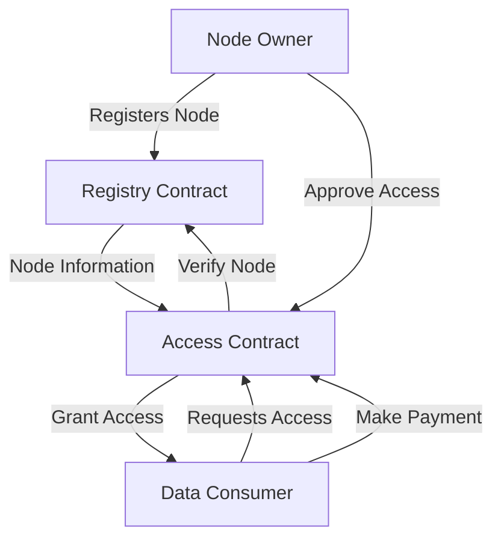

# # Polynomial Table: Decentralized Computational Resource Management

## Overview

Polynomial Table is a cutting-edge Clarity smart contract project designed to facilitate decentralized computational resource management. It provides a robust framework for registering, accessing, and rating computational nodes within a secure blockchain environment.

### Key Features

- **Node Registration**: Computational nodes can be registered with comprehensive metadata
- **Access Control**: Fine-grained permission management for computational resources
- **Reputation System**: Built-in rating and reputation tracking mechanism
- **Flexible Payment Models**: Support for one-time and subscription-based access

## Architecture

The project consists of two primary smart contracts:

1. **Polynomial Registry Contract**: 
   - Central registry for computational nodes
   - Manages node metadata and reputation
   - Handles node registration and status updates

2. **Polynomial Access Contract**:
   - Manages access requests to computational resources
   - Implements payment processing
   - Provides access control and verification mechanisms

## Use Cases

- IoT Data Processing
- Distributed Machine Learning
- Computational Resource Sharing
- Blockchain-based Compute Marketplaces

## Getting Started

### Prerequisites

- Stacks Blockchain
- Clarinet
- Basic understanding of Clarity smart contracts

### Installation

```bash
git clone https://github.com/polynomial-labs/polynomial-table.git
cd polynomial-table
clarinet integrate
```

## Development

- `clarinet check`: Verify contract syntax
- `clarinet test`: Run contract test suite
- `clarinet console`: Interactive contract environment

## Contributing

Contributions are welcome! Please see our [Contributing Guidelines](CONTRIBUTING.md)

## License

MIT License

## Contact

Polynomial Labs - [contact@polynomiallabs.io](mailto:contact@polynomiallabs.io) IoT Management

# Polynomial Table: Decentralized Computational Resource Management

## Overview

Polynomial Table is a cutting-edge Clarity smart contract project designed to facilitate decentralized computational resource management. It provides a robust framework for registering, accessing, and rating computational nodes within a secure blockchain environment.

### Key Features

- **Node Registration**: Computational nodes can be registered with comprehensive metadata
- **Access Control**: Fine-grained permission management for computational resources
- **Reputation System**: Built-in rating and reputation tracking mechanism
- **Flexible Payment Models**: Support for one-time and subscription-based access

## Architecture

The project consists of two primary smart contracts:

1. **Polynomial Registry Contract**: 
   - Central registry for computational nodes
   - Manages node metadata and reputation
   - Handles node registration and status updates

2. **Polynomial Access Contract**:
   - Manages access requests to computational resources
   - Implements payment processing
   - Provides access control and verification mechanisms

## Use Cases

- IoT Data Processing
- Distributed Machine Learning
- Computational Resource Sharing
- Blockchain-based Compute Marketplaces

## Getting Started

### Prerequisites

- Stacks Blockchain
- Clarinet
- Basic understanding of Clarity smart contracts

### Installation

```bash
git clone https://github.com/polynomial-labs/polynomial-table.git
cd polynomial-table
clarinet integrate
```

## Development

- `clarinet check`: Verify contract syntax
- `clarinet test`: Run contract test suite
- `clarinet console`: Interactive contract environment

## Contributing

Contributions are welcome! Please see our [Contributing Guidelines](CONTRIBUTING.md)

## License

MIT License

## Contact

Polynomial Labs - [contact@polynomiallabs.io](mailto:contact@polynomiallabs.io) is a decentralized IoT node management system built on the Stacks blockchain that enables secure registration, management, and access control of IoT devices. The platform creates a trustless ecosystem where IoT node operators can connect their devices to the network, while data consumers can discover available nodes and request access to their data streams.

## Overview

The # Polynomial Table: Decentralized Computational Resource Management

## Overview

Polynomial Table is a cutting-edge Clarity smart contract project designed to facilitate decentralized computational resource management. It provides a robust framework for registering, accessing, and rating computational nodes within a secure blockchain environment.

### Key Features

- **Node Registration**: Computational nodes can be registered with comprehensive metadata
- **Access Control**: Fine-grained permission management for computational resources
- **Reputation System**: Built-in rating and reputation tracking mechanism
- **Flexible Payment Models**: Support for one-time and subscription-based access

## Architecture

The project consists of two primary smart contracts:

1. **Polynomial Registry Contract**: 
   - Central registry for computational nodes
   - Manages node metadata and reputation
   - Handles node registration and status updates

2. **Polynomial Access Contract**:
   - Manages access requests to computational resources
   - Implements payment processing
   - Provides access control and verification mechanisms

## Use Cases

- IoT Data Processing
- Distributed Machine Learning
- Computational Resource Sharing
- Blockchain-based Compute Marketplaces

## Getting Started

### Prerequisites

- Stacks Blockchain
- Clarinet
- Basic understanding of Clarity smart contracts

### Installation

```bash
git clone https://github.com/polynomial-labs/polynomial-table.git
cd polynomial-table
clarinet integrate
```

## Development

- `clarinet check`: Verify contract syntax
- `clarinet test`: Run contract test suite
- `clarinet console`: Interactive contract environment

## Contributing

Contributions are welcome! Please see our [Contributing Guidelines](CONTRIBUTING.md)

## License

MIT License

## Contact

Polynomial Labs - [contact@polynomiallabs.io](mailto:contact@polynomiallabs.io) platform provides:

- Secure registration and management of IoT nodes
- Access control and permissions management
- Reputation tracking for nodes
- Flexible payment options (one-time and subscription)
- Decentralized discovery of IoT data sources

### Key Features

- Node registration with detailed metadata
- Verification system for trusted nodes
- Rating and reputation system
- Uptime tracking
- Access request and approval workflow
- Multiple payment models
- Permission management and access control

## Architecture

The system consists of two main smart contracts that work together to provide the complete functionality:



### Core Contracts

1. **# Polynomial Table: Decentralized Computational Resource Management

## Overview

Polynomial Table is a cutting-edge Clarity smart contract project designed to facilitate decentralized computational resource management. It provides a robust framework for registering, accessing, and rating computational nodes within a secure blockchain environment.

### Key Features

- **Node Registration**: Computational nodes can be registered with comprehensive metadata
- **Access Control**: Fine-grained permission management for computational resources
- **Reputation System**: Built-in rating and reputation tracking mechanism
- **Flexible Payment Models**: Support for one-time and subscription-based access

## Architecture

The project consists of two primary smart contracts:

1. **Polynomial Registry Contract**: 
   - Central registry for computational nodes
   - Manages node metadata and reputation
   - Handles node registration and status updates

2. **Polynomial Access Contract**:
   - Manages access requests to computational resources
   - Implements payment processing
   - Provides access control and verification mechanisms

## Use Cases

- IoT Data Processing
- Distributed Machine Learning
- Computational Resource Sharing
- Blockchain-based Compute Marketplaces

## Getting Started

### Prerequisites

- Stacks Blockchain
- Clarinet
- Basic understanding of Clarity smart contracts

### Installation

```bash
git clone https://github.com/polynomial-labs/polynomial-table.git
cd polynomial-table
clarinet integrate
```

## Development

- `clarinet check`: Verify contract syntax
- `clarinet test`: Run contract test suite
- `clarinet console`: Interactive contract environment

## Contributing

Contributions are welcome! Please see our [Contributing Guidelines](CONTRIBUTING.md)

## License

MIT License

## Contact

Polynomial Labs - [contact@polynomiallabs.io](mailto:contact@polynomiallabs.io) Registry Contract** (`# Polynomial Table: Decentralized Computational Resource Management

## Overview

Polynomial Table is a cutting-edge Clarity smart contract project designed to facilitate decentralized computational resource management. It provides a robust framework for registering, accessing, and rating computational nodes within a secure blockchain environment.

### Key Features

- **Node Registration**: Computational nodes can be registered with comprehensive metadata
- **Access Control**: Fine-grained permission management for computational resources
- **Reputation System**: Built-in rating and reputation tracking mechanism
- **Flexible Payment Models**: Support for one-time and subscription-based access

## Architecture

The project consists of two primary smart contracts:

1. **Polynomial Registry Contract**: 
   - Central registry for computational nodes
   - Manages node metadata and reputation
   - Handles node registration and status updates

2. **Polynomial Access Contract**:
   - Manages access requests to computational resources
   - Implements payment processing
   - Provides access control and verification mechanisms

## Use Cases

- IoT Data Processing
- Distributed Machine Learning
- Computational Resource Sharing
- Blockchain-based Compute Marketplaces

## Getting Started

### Prerequisites

- Stacks Blockchain
- Clarinet
- Basic understanding of Clarity smart contracts

### Installation

```bash
git clone https://github.com/polynomial-labs/polynomial-table.git
cd polynomial-table
clarinet integrate
```

## Development

- `clarinet check`: Verify contract syntax
- `clarinet test`: Run contract test suite
- `clarinet console`: Interactive contract environment

## Contributing

Contributions are welcome! Please see our [Contributing Guidelines](CONTRIBUTING.md)

## License

MIT License

## Contact

Polynomial Labs - [contact@polynomiallabs.io](mailto:contact@polynomiallabs.io)-registry.clar`)
   - Manages node registration and metadata
   - Handles node verification and status
   - Tracks node reputation and ratings

2. **# Polynomial Table: Decentralized Computational Resource Management

## Overview

Polynomial Table is a cutting-edge Clarity smart contract project designed to facilitate decentralized computational resource management. It provides a robust framework for registering, accessing, and rating computational nodes within a secure blockchain environment.

### Key Features

- **Node Registration**: Computational nodes can be registered with comprehensive metadata
- **Access Control**: Fine-grained permission management for computational resources
- **Reputation System**: Built-in rating and reputation tracking mechanism
- **Flexible Payment Models**: Support for one-time and subscription-based access

## Architecture

The project consists of two primary smart contracts:

1. **Polynomial Registry Contract**: 
   - Central registry for computational nodes
   - Manages node metadata and reputation
   - Handles node registration and status updates

2. **Polynomial Access Contract**:
   - Manages access requests to computational resources
   - Implements payment processing
   - Provides access control and verification mechanisms

## Use Cases

- IoT Data Processing
- Distributed Machine Learning
- Computational Resource Sharing
- Blockchain-based Compute Marketplaces

## Getting Started

### Prerequisites

- Stacks Blockchain
- Clarinet
- Basic understanding of Clarity smart contracts

### Installation

```bash
git clone https://github.com/polynomial-labs/polynomial-table.git
cd polynomial-table
clarinet integrate
```

## Development

- `clarinet check`: Verify contract syntax
- `clarinet test`: Run contract test suite
- `clarinet console`: Interactive contract environment

## Contributing

Contributions are welcome! Please see our [Contributing Guidelines](CONTRIBUTING.md)

## License

MIT License

## Contact

Polynomial Labs - [contact@polynomiallabs.io](mailto:contact@polynomiallabs.io) Access Contract** (`# Polynomial Table: Decentralized Computational Resource Management

## Overview

Polynomial Table is a cutting-edge Clarity smart contract project designed to facilitate decentralized computational resource management. It provides a robust framework for registering, accessing, and rating computational nodes within a secure blockchain environment.

### Key Features

- **Node Registration**: Computational nodes can be registered with comprehensive metadata
- **Access Control**: Fine-grained permission management for computational resources
- **Reputation System**: Built-in rating and reputation tracking mechanism
- **Flexible Payment Models**: Support for one-time and subscription-based access

## Architecture

The project consists of two primary smart contracts:

1. **Polynomial Registry Contract**: 
   - Central registry for computational nodes
   - Manages node metadata and reputation
   - Handles node registration and status updates

2. **Polynomial Access Contract**:
   - Manages access requests to computational resources
   - Implements payment processing
   - Provides access control and verification mechanisms

## Use Cases

- IoT Data Processing
- Distributed Machine Learning
- Computational Resource Sharing
- Blockchain-based Compute Marketplaces

## Getting Started

### Prerequisites

- Stacks Blockchain
- Clarinet
- Basic understanding of Clarity smart contracts

### Installation

```bash
git clone https://github.com/polynomial-labs/polynomial-table.git
cd polynomial-table
clarinet integrate
```

## Development

- `clarinet check`: Verify contract syntax
- `clarinet test`: Run contract test suite
- `clarinet console`: Interactive contract environment

## Contributing

Contributions are welcome! Please see our [Contributing Guidelines](CONTRIBUTING.md)

## License

MIT License

## Contact

Polynomial Labs - [contact@polynomiallabs.io](mailto:contact@polynomiallabs.io)-access.clar`)
   - Manages access requests and permissions
   - Handles payment processing
   - Controls access verification

## Contract Documentation

### Registry Contract

The registry contract serves as the central database for IoT nodes in the ecosystem.

#### Key Functions

```clarity
(define-public (register-node (name (string-ascii 100)) 
                             (description (string-ascii 500))
                             (location (string-ascii 100))
                             (capabilities (string-ascii 500))
                             (data-types (string-ascii 500))
                             (refresh-rate uint)
                             (price-per-request uint))
```

- Registers a new IoT node with metadata
- Returns the unique node ID

```clarity
(define-public (update-node-status (node-id uint) (new-status uint))
```

- Updates node operational status (active/inactive/maintenance)
- Only callable by node owner

```clarity
(define-public (rate-node (node-id uint) (rating uint))
```

- Allows users to rate nodes (1-5 scale)
- Updates node reputation metrics

### Access Contract

The access contract manages permissions and payment processing for node access.

#### Key Functions

```clarity
(define-public (request-access (node-id uint) 
                              (purpose (string-ascii 100))
                              (duration-blocks uint)
                              (payment-amount uint)
                              (payment-type uint)
                              (payment-interval uint))
```

- Submits request for node access
- Supports one-time and subscription payments

```clarity
(define-public (approve-access (request-id uint))
```

- Approves access request and processes payment
- Only callable by node owner

```clarity
(define-public (verify-access (node-id uint) (requester principal))
```

- Verifies if a requester has valid access to a node
- Used by other contracts for access control

## Getting Started

### Prerequisites

- Clarinet (latest version)
- Stacks wallet for deployment and testing

### Installation

1. Clone the repository
2. Initialize Clarinet project:
```bash
clarinet new # Polynomial Table: Decentralized Computational Resource Management

## Overview

Polynomial Table is a cutting-edge Clarity smart contract project designed to facilitate decentralized computational resource management. It provides a robust framework for registering, accessing, and rating computational nodes within a secure blockchain environment.

### Key Features

- **Node Registration**: Computational nodes can be registered with comprehensive metadata
- **Access Control**: Fine-grained permission management for computational resources
- **Reputation System**: Built-in rating and reputation tracking mechanism
- **Flexible Payment Models**: Support for one-time and subscription-based access

## Architecture

The project consists of two primary smart contracts:

1. **Polynomial Registry Contract**: 
   - Central registry for computational nodes
   - Manages node metadata and reputation
   - Handles node registration and status updates

2. **Polynomial Access Contract**:
   - Manages access requests to computational resources
   - Implements payment processing
   - Provides access control and verification mechanisms

## Use Cases

- IoT Data Processing
- Distributed Machine Learning
- Computational Resource Sharing
- Blockchain-based Compute Marketplaces

## Getting Started

### Prerequisites

- Stacks Blockchain
- Clarinet
- Basic understanding of Clarity smart contracts

### Installation

```bash
git clone https://github.com/polynomial-labs/polynomial-table.git
cd polynomial-table
clarinet integrate
```

## Development

- `clarinet check`: Verify contract syntax
- `clarinet test`: Run contract test suite
- `clarinet console`: Interactive contract environment

## Contributing

Contributions are welcome! Please see our [Contributing Guidelines](CONTRIBUTING.md)

## License

MIT License

## Contact

Polynomial Labs - [contact@polynomiallabs.io](mailto:contact@polynomiallabs.io)
```
3. Copy contract files to `contracts/` directory
4. Run tests:
```bash
clarinet test
```

### Basic Usage

1. Register a node:
```clarity
(contract-call? .# Polynomial Table: Decentralized Computational Resource Management

## Overview

Polynomial Table is a cutting-edge Clarity smart contract project designed to facilitate decentralized computational resource management. It provides a robust framework for registering, accessing, and rating computational nodes within a secure blockchain environment.

### Key Features

- **Node Registration**: Computational nodes can be registered with comprehensive metadata
- **Access Control**: Fine-grained permission management for computational resources
- **Reputation System**: Built-in rating and reputation tracking mechanism
- **Flexible Payment Models**: Support for one-time and subscription-based access

## Architecture

The project consists of two primary smart contracts:

1. **Polynomial Registry Contract**: 
   - Central registry for computational nodes
   - Manages node metadata and reputation
   - Handles node registration and status updates

2. **Polynomial Access Contract**:
   - Manages access requests to computational resources
   - Implements payment processing
   - Provides access control and verification mechanisms

## Use Cases

- IoT Data Processing
- Distributed Machine Learning
- Computational Resource Sharing
- Blockchain-based Compute Marketplaces

## Getting Started

### Prerequisites

- Stacks Blockchain
- Clarinet
- Basic understanding of Clarity smart contracts

### Installation

```bash
git clone https://github.com/polynomial-labs/polynomial-table.git
cd polynomial-table
clarinet integrate
```

## Development

- `clarinet check`: Verify contract syntax
- `clarinet test`: Run contract test suite
- `clarinet console`: Interactive contract environment

## Contributing

Contributions are welcome! Please see our [Contributing Guidelines](CONTRIBUTING.md)

## License

MIT License

## Contact

Polynomial Labs - [contact@polynomiallabs.io](mailto:contact@polynomiallabs.io)-registry register-node 
    "Temperature Sensor" 
    "Environmental monitoring sensor" 
    "New York" 
    "Temperature, Humidity" 
    "celsius, percent" 
    u300 
    u100)
```

2. Request access:
```clarity
(contract-call? .# Polynomial Table: Decentralized Computational Resource Management

## Overview

Polynomial Table is a cutting-edge Clarity smart contract project designed to facilitate decentralized computational resource management. It provides a robust framework for registering, accessing, and rating computational nodes within a secure blockchain environment.

### Key Features

- **Node Registration**: Computational nodes can be registered with comprehensive metadata
- **Access Control**: Fine-grained permission management for computational resources
- **Reputation System**: Built-in rating and reputation tracking mechanism
- **Flexible Payment Models**: Support for one-time and subscription-based access

## Architecture

The project consists of two primary smart contracts:

1. **Polynomial Registry Contract**: 
   - Central registry for computational nodes
   - Manages node metadata and reputation
   - Handles node registration and status updates

2. **Polynomial Access Contract**:
   - Manages access requests to computational resources
   - Implements payment processing
   - Provides access control and verification mechanisms

## Use Cases

- IoT Data Processing
- Distributed Machine Learning
- Computational Resource Sharing
- Blockchain-based Compute Marketplaces

## Getting Started

### Prerequisites

- Stacks Blockchain
- Clarinet
- Basic understanding of Clarity smart contracts

### Installation

```bash
git clone https://github.com/polynomial-labs/polynomial-table.git
cd polynomial-table
clarinet integrate
```

## Development

- `clarinet check`: Verify contract syntax
- `clarinet test`: Run contract test suite
- `clarinet console`: Interactive contract environment

## Contributing

Contributions are welcome! Please see our [Contributing Guidelines](CONTRIBUTING.md)

## License

MIT License

## Contact

Polynomial Labs - [contact@polynomiallabs.io](mailto:contact@polynomiallabs.io)-access request-access 
    node-id 
    "Research project" 
    u1000 
    u50 
    u1 
    u100)
```

## Security Considerations

- Node owners should carefully verify access requests before approval
- Access permissions are time-bound and can be revoked
- Subscription payments must be maintained to keep access active
- Node reputation should be considered when requesting access
- Contract admin functions should be properly secured in production

## Development

### Testing

Run the test suite:
```bash
clarinet test tests/# Polynomial Table: Decentralized Computational Resource Management

## Overview

Polynomial Table is a cutting-edge Clarity smart contract project designed to facilitate decentralized computational resource management. It provides a robust framework for registering, accessing, and rating computational nodes within a secure blockchain environment.

### Key Features

- **Node Registration**: Computational nodes can be registered with comprehensive metadata
- **Access Control**: Fine-grained permission management for computational resources
- **Reputation System**: Built-in rating and reputation tracking mechanism
- **Flexible Payment Models**: Support for one-time and subscription-based access

## Architecture

The project consists of two primary smart contracts:

1. **Polynomial Registry Contract**: 
   - Central registry for computational nodes
   - Manages node metadata and reputation
   - Handles node registration and status updates

2. **Polynomial Access Contract**:
   - Manages access requests to computational resources
   - Implements payment processing
   - Provides access control and verification mechanisms

## Use Cases

- IoT Data Processing
- Distributed Machine Learning
- Computational Resource Sharing
- Blockchain-based Compute Marketplaces

## Getting Started

### Prerequisites

- Stacks Blockchain
- Clarinet
- Basic understanding of Clarity smart contracts

### Installation

```bash
git clone https://github.com/polynomial-labs/polynomial-table.git
cd polynomial-table
clarinet integrate
```

## Development

- `clarinet check`: Verify contract syntax
- `clarinet test`: Run contract test suite
- `clarinet console`: Interactive contract environment

## Contributing

Contributions are welcome! Please see our [Contributing Guidelines](CONTRIBUTING.md)

## License

MIT License

## Contact

Polynomial Labs - [contact@polynomiallabs.io](mailto:contact@polynomiallabs.io)_test.ts
```

### Local Development

1. Start local chain:
```bash
clarinet start
```

2. Deploy contracts:
```bash
clarinet deploy
```

3. Interact using console:
```bash
clarinet console
```